# MikroTik: MPLS Layer 3

## MPLS (Multi-Protocol Label Switching) Layer-3 configuration with MikroTik router.

### MPLS Layer 3 network scheme
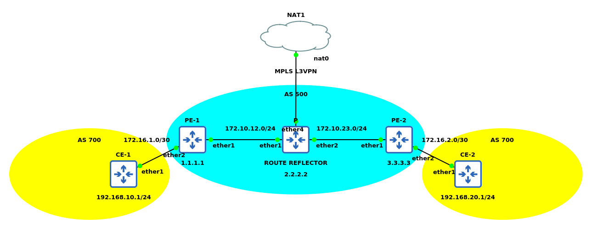

### Configure P
```
/ip address add address=172.10.12.2/24 interface=ether1 network=172.10.12.0
/ip address add address=172.10.23.2/24 interface=ether2 network=172.10.23.0
/interface bridge add name=loopback0
/ip address add address=2.2.2.2 interface=loopback0 network=2.2.2.2
/ip dhcp-client add disabled=no interface=ether4 use-peer-dns=no
/routing ospf instance add distribute-default=always-as-type-1 name=600 router-id=2.2.2.2
/routing ospf area add instance=600 name=600
/routing ospf network add area=600 network=2.2.2.2/32
/routing ospf network add area=600 network=172.10.12.0/24
/routing ospf network add area=600 network=172.10.23.0/24
/routing bgp instance add as=500 name=bgp500 router-id=2.2.2.2
/routing bgp peer add address-families=vpnv4 instance=bgp500 name=500 remote-address=1.1.1.1 remote-as=500 route-reflect=yes ttl=default update-source=loopback0
/routing bgp peer add address-families=vpnv4 instance=bgp500 name=500 remote-address=3.3.3.3 remote-as=500 route-reflect=yes ttl=default update-source=loopback0
/mpls ldp set enabled=yes lsr-id=2.2.2.2 transport-address=2.2.2.2
/mpls ldp interface add interface=ether1 transport-address=2.2.2.2
/mpls ldp interface add interface=ether2 transport-address=2.2.2.2
# Configure NAT from inside network to outside public internet
/ip firewall nat add action=masquerade chain=srcnat out-interface=ether4
# Configure DNS name resolver
/ip dns set allow-remote-requests=yes servers=8.8.8.8
# Drop all invalid connection state
/ip firewall filter add action=drop chain=forward connection-state=invalid
```
### Verify Configurations P
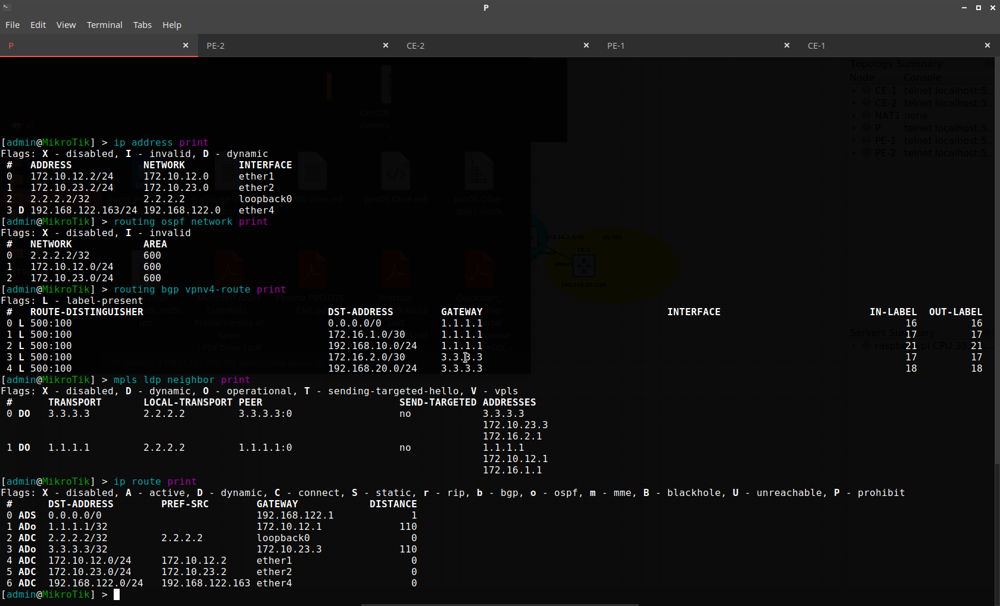
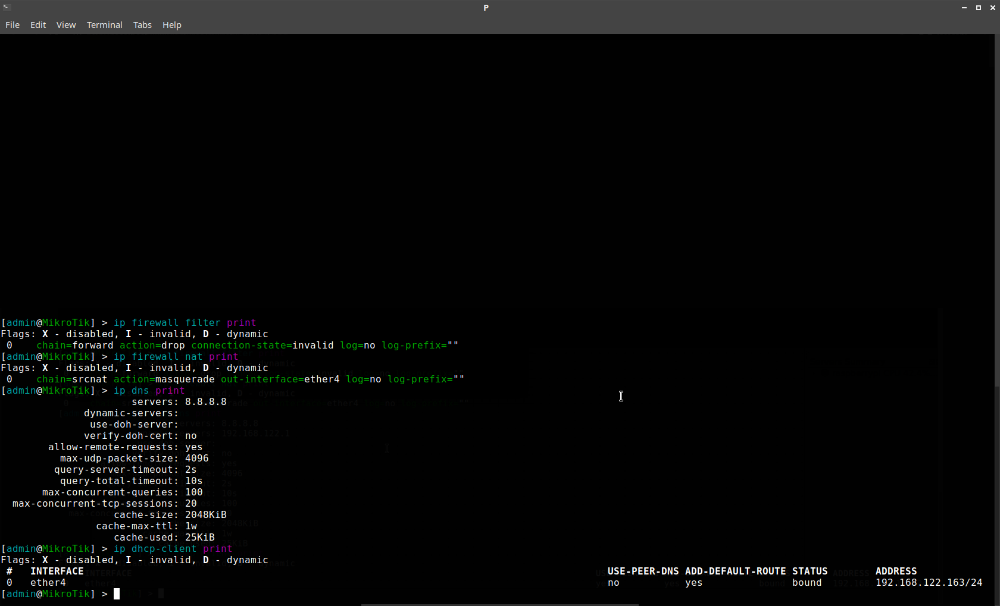
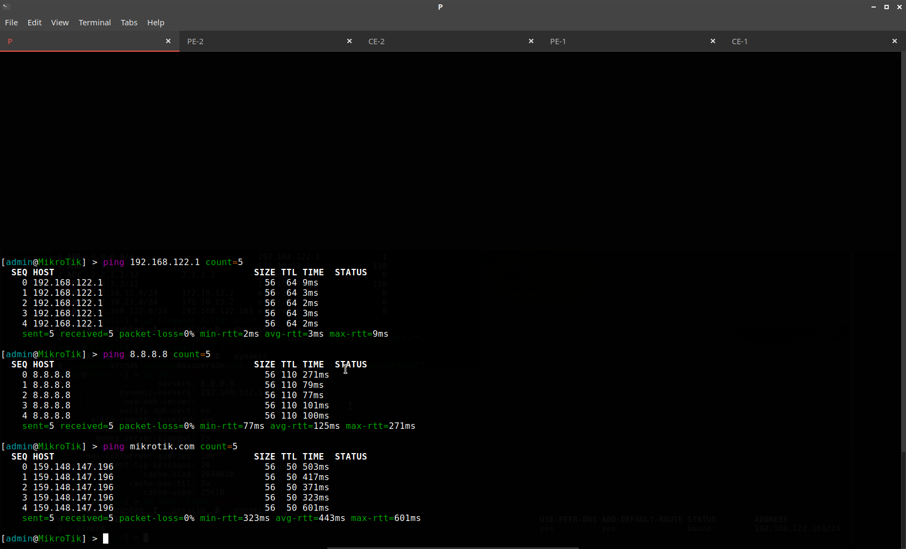

### Configure PE-1
```
/ip address add address=172.10.12.1/24 interface=ether1 network=172.10.12.0
/interface bridge add name=loopback0
/ip address add address=1.1.1.1 interface=loopback0 network=1.1.1.1
/routing ospf instance add name=600 router-id=1.1.1.1
/routing ospf area add instance=600 name=600
/routing ospf network add area=600 network=1.1.1.1/32
/routing ospf network add area=600 network=172.10.12.0/24
/routing bgp instance add as=500 client-to-client-reflection=no name=bgp500 router-id=1.1.1.1
/routing bgp peer add address-families=vpnv4 instance=bgp500 name=500 remote-address=2.2.2.2 remote-as=500 ttl=default update-source=loopback0
/mpls ldp set enabled=yes lsr-id=1.1.1.1 transport-address=1.1.1.1
/mpls ldp interface add interface=ether1 transport-address=1.1.1.1
/ip route vrf add export-route-targets=500:100 import-route-targets=500:100 interfaces=ether2 route-distinguisher=500:100 routing-mark=CE
/ip address add address=172.16.1.1/30 interface=ether2 network=172.16.1.0
/routing bgp instance add as=500 client-to-client-reflection=no name=bgp700 router-id=172.16.1.1 routing-table=CE
/routing bgp instance vrf add instance=bgp500 redistribute-connected=yes redistribute-other-bgp=yes redistribute-static=yes routing-mark=CE
/routing bgp peer add as-override=yes default-originate=always instance=bgp700 name=700 remote-address=172.16.1.2 remote-as=700 ttl=default
# Configure default route for CE-1
/ip route add dst-address=0.0.0.0/0 gateway=172.10.12.2@main routing-mark=CE
# Configure destination address list CE-2
/ip firewall address-list add address=192.168.20.0/24 list=addressCE
/ip firewall address-list add address=172.16.2.0/30 list=addressCE
# Configure firewall mangle for marking transmit-receive from public internet to CE-1
/ip firewall mangle add action=mark-routing chain=prerouting new-routing-mark=CE passthrough=yes
# Configure NAT from inside network to outside public internet without translation destination to address list CE-2
/ip firewall nat add action=masquerade chain=srcnat dst-address-list=!addressCE out-interface=ether1
# Configure DNS name resolver
/ip dns set allow-remote-requests=yes servers=8.8.8.8
```
### Verify Configurations PE-1
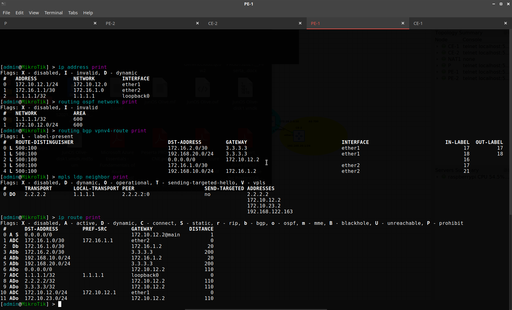
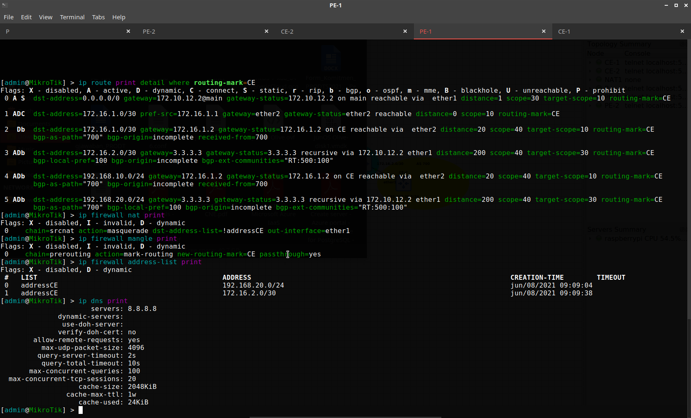
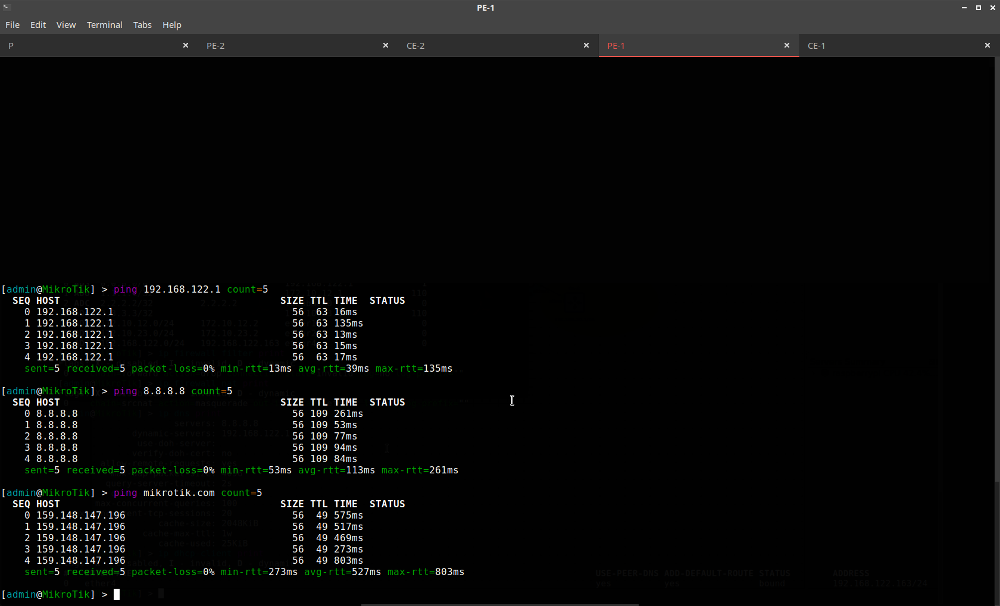

### Configure PE-2
```
/ip address add address=172.10.23.1/24 interface=ether1 network=172.10.23.0
/interface bridge add name=loopback0
/ip address add address=3.3.3.3 interface=loopback0 network=3.3.3.3
/routing ospf instance add name=600 router-id=3.3.3.3
/routing ospf area add instance=600 name=600
/routing ospf network add area=600 network=3.3.3.3/32
/routing ospf network add area=600 network=172.10.23.0/24
/routing bgp instance add as=500 client-to-client-reflection=no name=bgp500 router-id=3.3.3.3
/routing bgp peer add address-families=vpnv4 instance=bgp500 name=500 remote-address=2.2.2.2 remote-as=500 ttl=default update-source=loopback0
/mpls ldp set enabled=yes lsr-id=3.3.3.3 transport-address=3.3.3.3
/mpls ldp interface add interface=ether1 transport-address=3.3.3.3
/ip route vrf add export-route-targets=500:100 import-route-targets=500:100 interfaces=ether2 route-distinguisher=500:100 routing-mark=CE
/ip address add address=172.16.2.1/30 interface=ether2 network=172.16.2.0
/routing bgp instance add as=500 client-to-client-reflection=no name=bgp700 router-id=172.16.2.1 routing-table=CE
/routing bgp instance vrf add instance=bgp500 redistribute-connected=yes redistribute-other-bgp=yes redistribute-static=yes routing-mark=CE
/routing bgp peer add as-override=yes default-originate=always instance=bgp700 name=700 remote-address=172.16.2.2 remote-as=700 ttl=default
# Configure default route for CE-2
/ip route add dst-address=0.0.0.0/0 gateway=172.10.23.2@main routing-mark=CE
# Configure destination address list CE-1
/ip firewall address-list add address=192.168.10.0/24 list=addressCE
/ip firewall address-list add address=172.16.1.0/30 list=addressCE
# Configure firewall mangle for marking transmit-receive from public internet to CE-2
/ip firewall mangle add action=mark-routing chain=prerouting new-routing-mark=CE passthrough=yes
# Configure NAT from inside network to outside public internet without translation destination to address list CE-2
/ip firewall nat add action=masquerade chain=srcnat dst-address-list=!addressCE out-interface=ether1
# Configure DNS name resolver
/ip dns set allow-remote-requests=yes servers=8.8.8.8
```
### Verify Configurations PE-2
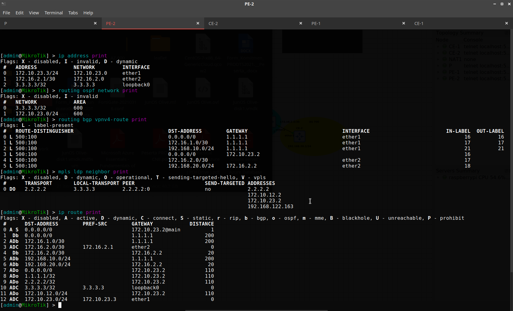
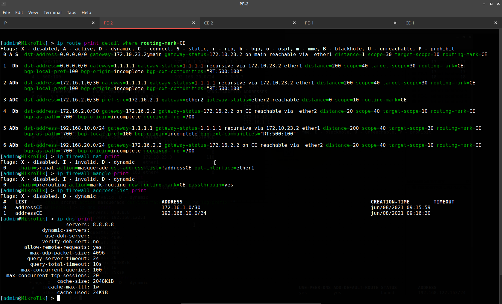
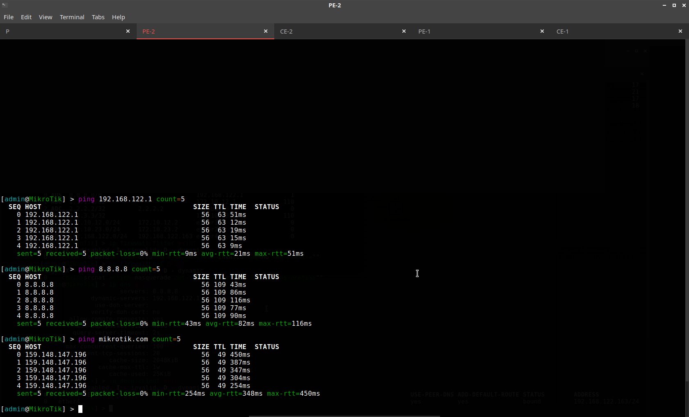

### Configure CE-1
```
# Configure IP address point-to-point to PE-1
/ip address add address=172.16.1.2/30 interface=ether1 network=172.16.1.0
# Configure IP address local
/ip address add address=192.168.10.1/24 interface=ether2 network=192.168.10.0
# Configure BGP instance
/routing bgp instance add as=700 client-to-client-reflection=no name=bgp700 redistribute-connected=yes router-id=172.16.1.2
# Configure BGP peer to PE-1
/routing bgp peer add instance=bgp700 name=700 remote-address=172.16.1.1 remote-as=500 ttl=default
# Configure DNS name resolver
/ip dns set allow-remote-requests=yes servers=8.8.8.8
```
### Verify Configurations CE-1
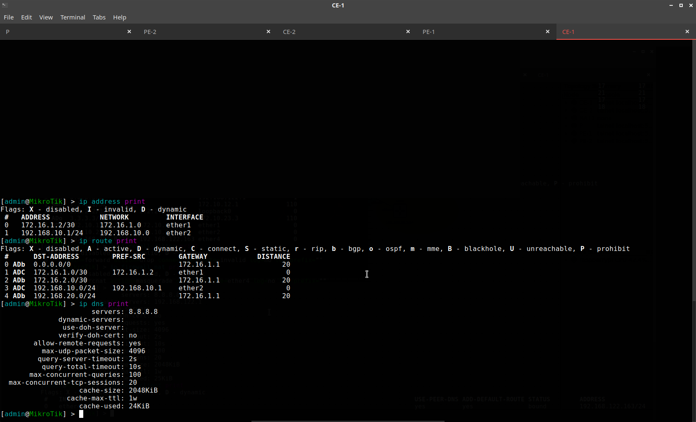
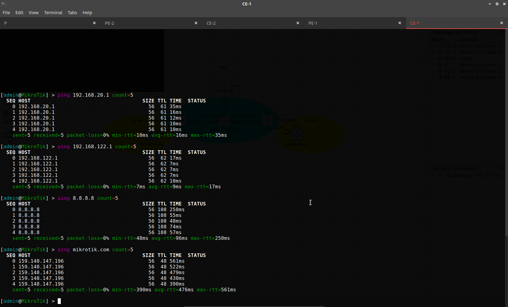

### Configure CE-2
```
# Configure IP address point-to-point to PE-2
/ip address add address=172.16.2.2/30 interface=ether1 network=172.16.2.0
# Configure IP address local
/ip address add address=192.168.20.1/24 interface=ether2 network=192.168.20.0
# Configure BGP instance
/routing bgp instance add as=700 client-to-client-reflection=no name=bgp700 redistribute-connected=yes router-id=172.16.2.2
# Configure BGP peer to PE-2
/routing bgp peer add instance=bgp700 name=700 remote-address=172.16.2.1 remote-as=500 ttl=default
# Configure DNS name resolver
/ip dns set allow-remote-requests=yes servers=8.8.8.8
```
### Verify Configurations CE-2
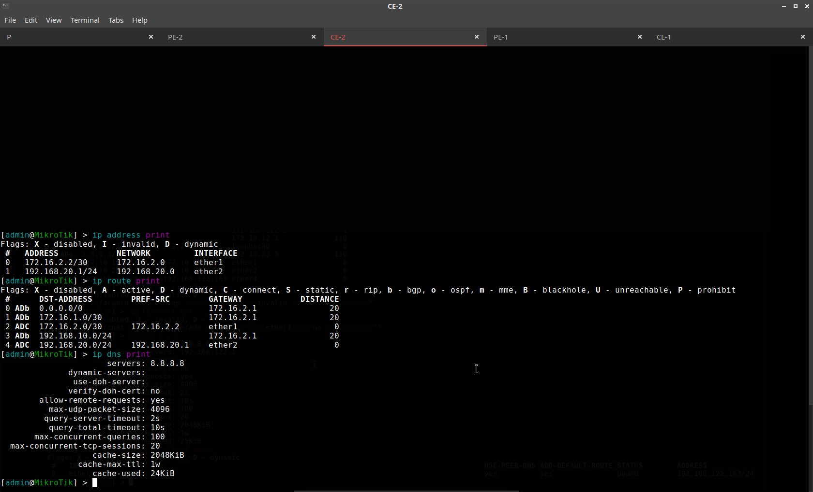
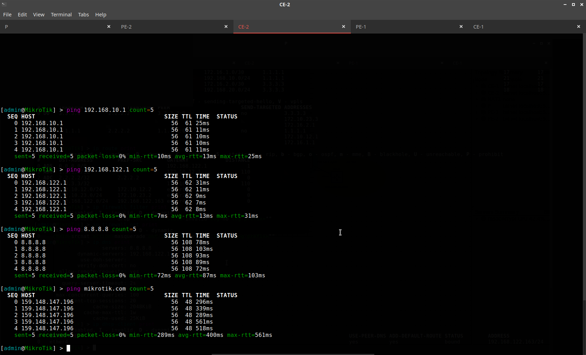

** **

**NOTE:**<br>
NAT node is allows to connect a topology to internet via NAT. By default, NAT node runs a DHCP server with a predefined pool in the 122.0/24 range.<br>
Tools<br>
GNS3 version 2.2.20<br>
MikroTik RouterOS 6.47.7 (Qemu VM)<br>
Host<br>
Raspbian GNU/Linux 10 (buster) Kernel Linux 5.10.17-v7l+ armv7l Twister OS version 2.0.2<br>
Raspberry Pi 4 ARM 64-bit 4GB RAM
